# Industry Specialist Pack - Mod
This mod adds Specialists focused on Industry Buildings into Anno 117. This Mod is part as a submod of "Extended Specialists Mod"
***
### Item Overview (AI Generated - Might contain Issues. Please point them out if you find some)
***
Quick Links: 
* [Common Specialists](#common-specialists)
* [Rare Specialists](#rare-specialists)
  * [Additional Goods](#rare-additional-goods-specialists)
  * [Module Upgrade](#rare-module-upgrade-specialists)
  * [Production Upgrade](#rare-production-upgrade-specialists)
  * [Replace Input Upgrade](#rare-replace-input-specialists)
* [Epic Specialists](#epic-specialists)
  * [Additional Goods](#epic-additional-goods-specialists)
  * [Module Upgrade](#epic-module-upgrade-specialists)
  * [Production Upgrade](#epic-production-upgrade-specialists)
  * [Replace Input Upgrade](#epic-replace-input-specialists)
* [Legendary Specialists](#legendary-specialists)
### Common Specialists
| Image Preview | GUID | Internal Name | Item name (Title) | Description | Targets | Base Effects |
| :---: | :---: | :---: | :---: | :---: | :---: | :---: |
|  | 1600000025 | Specialist Area-Forestries-C | Young Arborist | Enjoys caring for trees. &#xD;(Industry-Pack) | All Forestries | • Area Reduction: 15% |
| 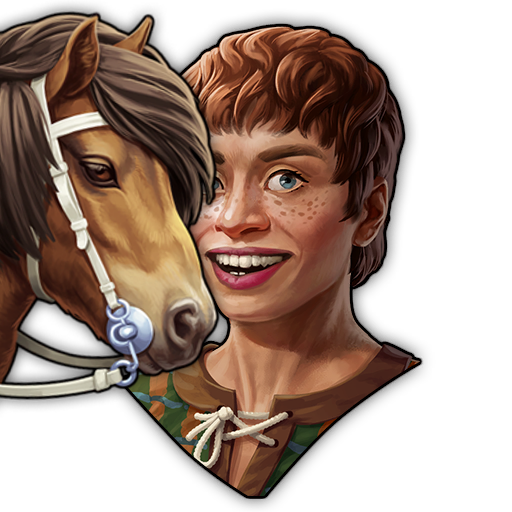 | 1600000027 | Specialist Area-Forest-Ponies-C | Wild Pony Huntress | Keeps behaving like a wild pony. &#xD;(Industry-Pack) | Horsecatcher | • Area Reduction: 10%  • Can Use Forests: True |
| 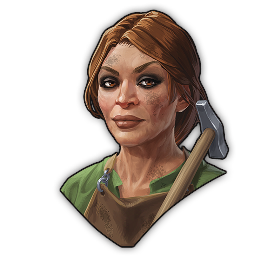 | 1600000194 | Specialist Upkeep-Upholsterer-C | Upholsterer Trainer | Teaches how to handle needle tools to prevent worker outages. &#xD;(Industry-Pack) | All Upholsterers | • -50% Maintenance Cost • -25% Workforce Maintenance |
***
### Rare Specialists
#### Rare Additional Goods Specialists 
| Image Preview | GUID | Internal Name | Item name (Title) | Description | Targets | Base Effects |
| :---: | :---: | :---: | :---: | :---: | :---: | :---: |
| 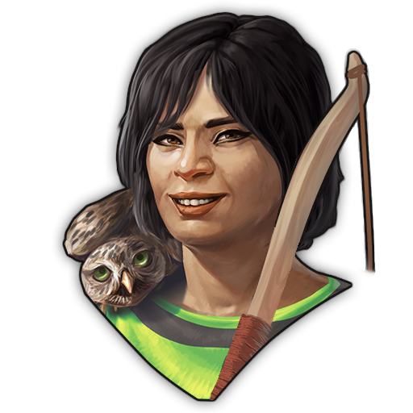 | 1600000200 | Specialist AddSame-Area-HuntersEels-R | Eager Huntress | Yearns for the hunt. (Industry-Pack) | All Hunting Cabins, Eel Grabber | • Area Reduction: -20% • Additional Output per 10th Cycle: +1 |
|  | 1600000192 | Specialist AddClay-WaterSlots-R | Clay Digger | Kept the fun from digging into Clay since the childhood. (Industry-Pack) | Clay Pit, Glass Smelter, Grain Mill, Sturgeon Hatchery, Gold Washer | • Additional Output per Cycle: +1 • +100% Maintenance Cost • +25% Workforce Maintenance. |

#### Rare Module Upgrade Specialists
| Image Preview | GUID | Internal Name | Item name (Title) | Description | Targets | Base Effects |
| :---: | :---: | :---: | :---: | :---: | :---: | :---: |
| 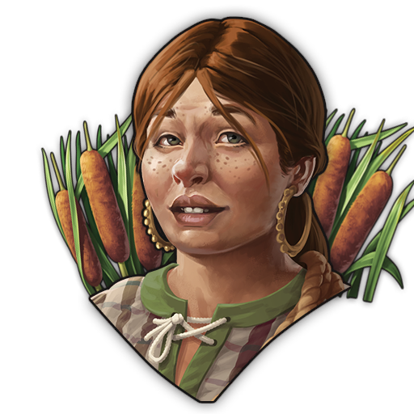 | 1600000198 | Specialist Module-Reed-R | Mud-covered Reedgrower | "Huh? What are you doing in my swamp?!" (Industry-Pack) | Reed Gatherer | • Additional Output per 6th Cycle: +1 • Module Count Limit: +50%. |

#### Rare Production Upgrade Specialists
| Image Preview | GUID | Internal Name | Item name (Title) | Description | Targets | Base Effects |
| :---: | :---: | :---: | :---: | :---: | :---: | :---: |
| 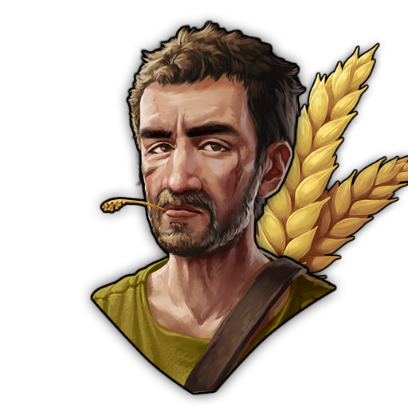 | 1600000272 | Specialist Prod-Farms-R | Quiet Farmer | His mind is always on his fields. (Industry-Pack) | All Arable Farms | • +20% Productivity Upgrade |
| 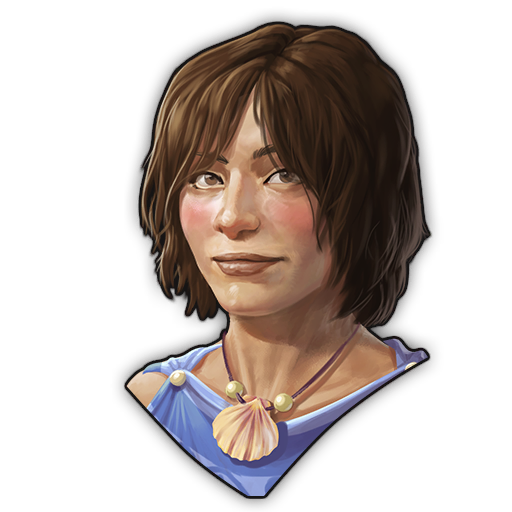 | 1600000202 | Specialist Prod-Coastal-R | Beachworker | Could work at the beach all the time. (Industry-Pack) | All Coastal Factories | • +20% Productivity Upgrade |
| 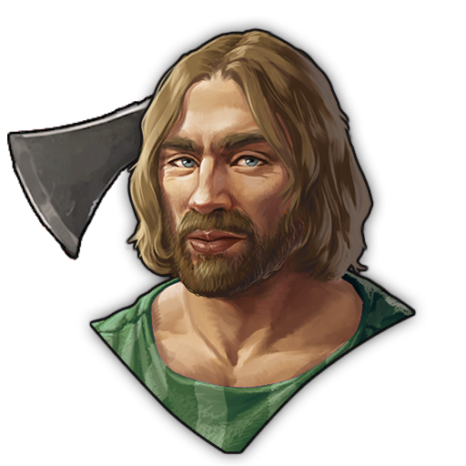 | 1600000270 | Specialist Prod-Forestries-R | Ambitious Forester | Making trees usable is his calling. (Industry-Pack) | All Forestries | • +20% Productivity Upgrade |
| 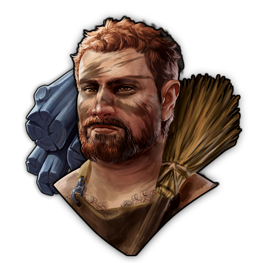 | 1600000204 | Specialist Prod-NFuel-FuelConsumer-R | Habitual Heater | "Baking stuff makes it taste better, why shouldn't it work for other things?" (Industry-Pack) | All Coal-Dependent-Buildings | • +30% Productivity Upgrade • Fuel Duration Penalty: Reduces fuel duration by 30%. |
| 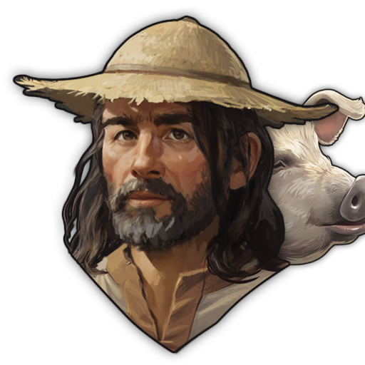 | 1600000274 | Specialist Prod-Pastures-R | Prudent Livestock Breeder | Make sure that every animal fulfills its contribution. (Industry-Pack) | All Pastures | • +20% Productivity Upgrade |
| 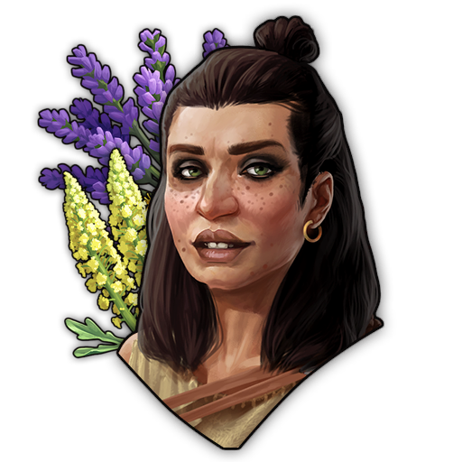 | 1600000276 | Specialist Prod-Plantations-R | Happy Plantation Helper | "You don't need much variation to be happy." (Industry-Pack) | All Plantations | • +20% Productivity Upgrade |

#### Rare Replace Input Specialists
| Image Preview | GUID | Internal Name | Item name (Title) | Description | Targets | Base Effects |
| :---: | :---: | :---: | :---: | :---: | :---: | :---: |
| 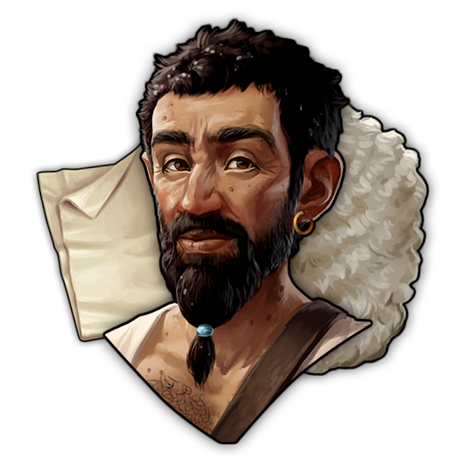 | 1600000428 | Specialist ReInput-Cloth-WoolRFlax-R | Criticized Wool Weaver | "Come on, don't be like that. With the right processing, wool can work just fine as a fabric." (Industry-Pack) | Weaver | • -35% Productivity Upgrade • Resource Replacement: Replaces input Flax with Wool. • -33% Workforce Maintenance • Replace worker Equites with Plebeians. |
| 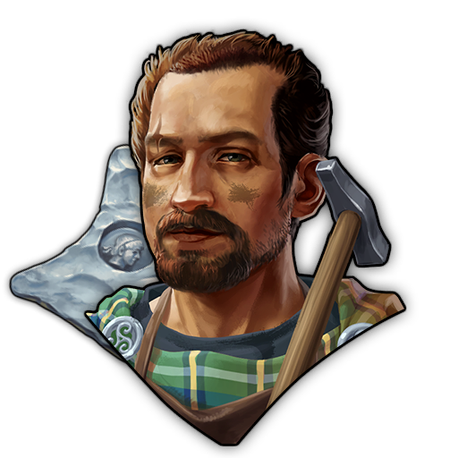 | 1600000132 | Specialist ReInput-Neck-SilberRGold-R | Gaius Septicius, the Silversmith | Silver is the new Gold! (Industry-Pack) | Jeweller | • Replaces required input from Gold to Silver. |
***
### Epic Specialists
#### Epic Additional Goods Specialists
| Image Preview | GUID | Internal Name | Item name (Title) | Description | Targets | Base Effects |
| :---: | :---: | :---: | :---: | :---: | :---: | :---: |
| 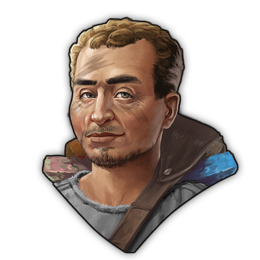 | 1600000106 | Specialist AddMineral-QuarriesMines-E | Marcus Speculator, Mineral Expert | Knows where to find any needed minerals. (Industry-Pack) | All: Quarries, Mines | • +1 Mineral per Cycle |
| 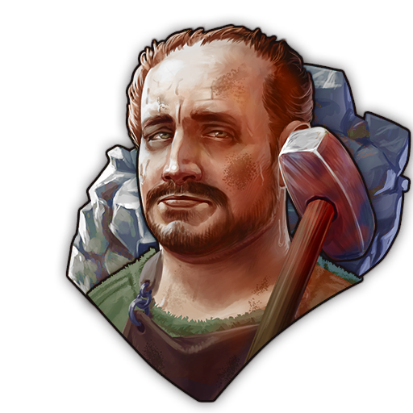 | 1600000122 | Specialist AddSilver-Mines-E | Decimus Argentarius, Experienced Silver Geologist | Has a talent for finding silver deposits. (Industry-Pack) | All Mines | • +1 Silver per Cycle |
| 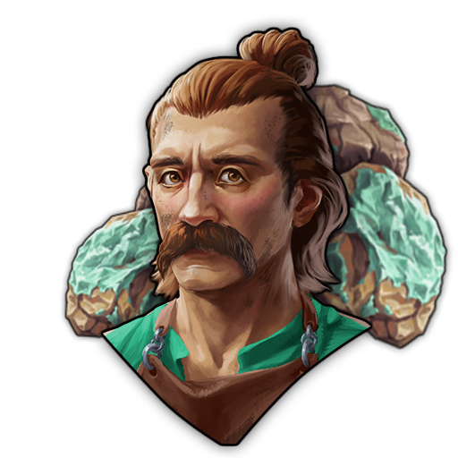 | 1600000280 | Specialist AddCopper-Mines-E | Coperovicos, the first Rock-born | Similar to his brother Stannos, he has a sixth sense for copper deposits. (Industry-Pack) | All Mines | • +1 Copper per Cycle |
| 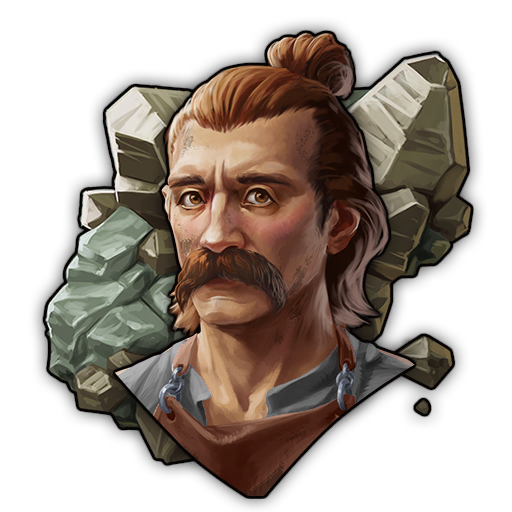 | 1600000282 | Specialist AddTin-Mines-E | Stannos, the second Rock-born | Similar to his brother Coperovicos, he has a sixth sense for tin deposits. (Industry-Pack) | All Mines | • +1 Tin per Cycle |
| 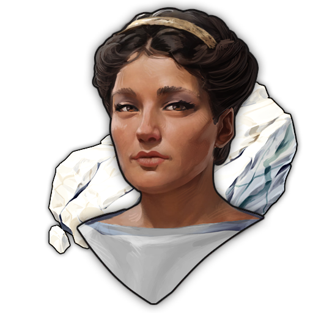 | 1600000319 | Specialist AddMarble-Quarries-E | Lucia Marmoria, Marble Geologist | Has a keen sense for marble. (Industry-Pack) | All Quarries | • +1 Marble per Cycle |
| 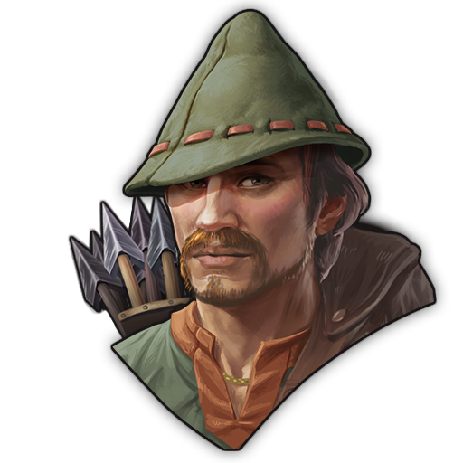 | 1600000154 | Specialist AddSame-Area-HuntersEels-E | Silvius Vercannos, Experienced Hunter | Such a great hunter, he would even catch mystical creatures. (Industry-Pack) | All Hunting Cabins, Eel Grabber | • Additional Output per 5th Cycle: +1 • Area Reduction: 10% |

#### Epic Module Upgrade Specialists
| Image Preview | GUID | Internal Name | Item name (Title) | Description | Targets | Base/Standard Effects |
| :---: | :---: | :---: | :---: | :---: | :---: | :--- |
| 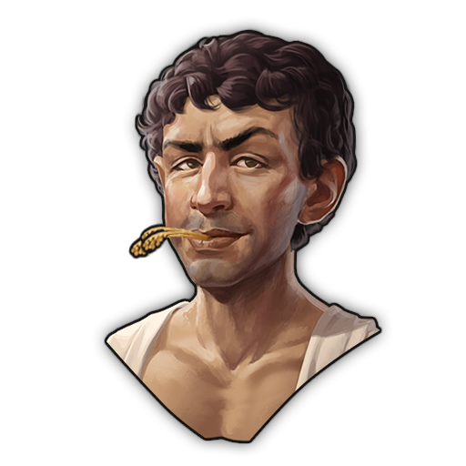 | 1600000108 | Specialist Module-Farms-E | Piso Agricola, Custodes of the Land | Enjoys the countrylife. &#xD;(Industry-Pack) | All Arable Farms | • Additional Output per 8th Cycle: +1 • Module Count Limit: +50% • Workforce Maintenance: +50% |
| 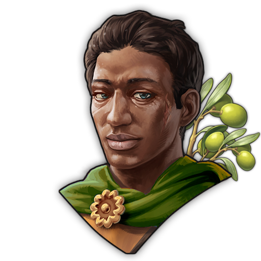 | 1600000110 | Specialist Module-Plantations-E | Publius Arboreus, the Planter For Generations | Reaps the fruits of what was planted generations ago. &#xD;(Industry-Pack) | All Plantations | • Additional Output per 8th Cycle: +1 • Module Count Limit: +50% • Workforce Maintenance: +50% |
| 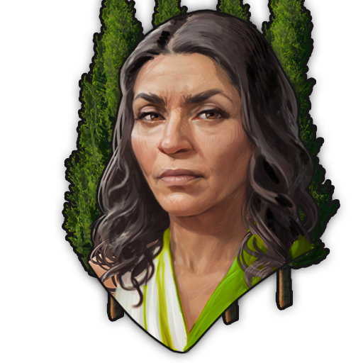 | 1600000321 | Specialist Module-Sandarak-E | Aurelia Sandaracina Furiosa | Gets angry if the sandarak trees aren't perfectly in shape. &#xD;(Industry-Pack) | Sandarac Nursery | • Additional Output per 8th Cycle: +1 • Module Count Limit: +50% • Workforce Maintenance: +50% |
|  | 1600000112 | Specialist Module-Pastures-E | Junia Pascua, Animal Caretaker | Best caretaker any animal could dream of. &#xD;(Industry-Pack) | All Pastures | • Additional Output per 8th Cycle: +1 • Module Count Limit: +100% • Workforce Maintenance: +100% |

#### Epic Production Upgrade Specialists
| Image Preview | GUID | Internal Name | Item name (Title) | Description | Targets | Base Effects |
| :---: | :---: | :---: | :---: | :---: | :---: | :---: |
| 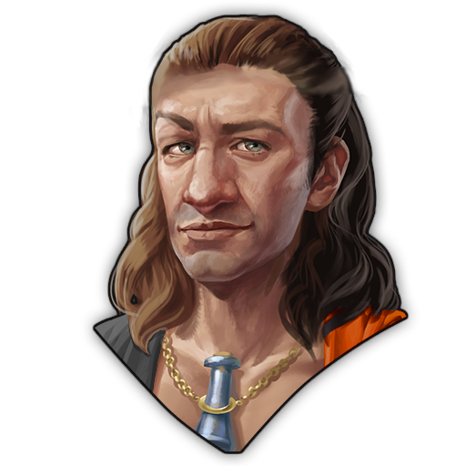 | 1600000002 | Specialist Prod-Extractors-E | Vullius Brixantus, Trained Extractor | Knows all the fundamentals of the extraction of elements. (Industry-Pack) | All Extractors | • +35% Productivity Boost |
| 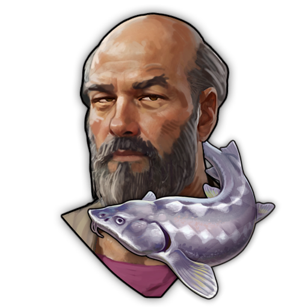 | 1600000325 | Specialist Prod-Fisheries-E | Lucius Amnius Piscator, Talking Fisherman | Can communicate with the Fish. (Industry-Pack) | All Fisheries | • +35% Productivity Boost |
|  | 1600000137 | Specialist Prod-Gatherers-E | Felix Selectorius, Lucky Gatherer | Always has a lucky touch when it comes to collecting. (Industry-Pack) | All Gatherers | • +35% Productivity Boost |
| 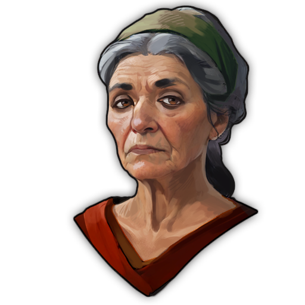 | 1600000323 | Specialist Prod-PitsQuarries-E | Cassia Ferrata, Pit Foreman | Makes the earth tremble by her mere presence. (Industry-Pack) | All Pits and Quarries | • +35% Productivity Boost |
| 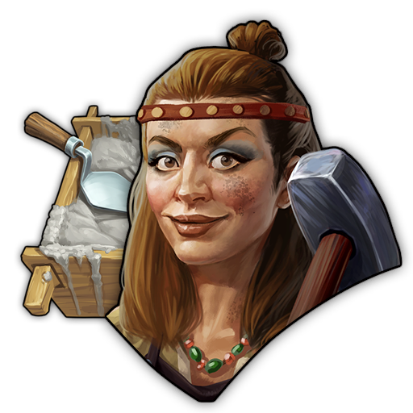 | 1600000430 | Specialist Prod-Refineries-E | Mathairne Ní Ádhmaid, Material Expert | Provides you with all the materials you need to build your cities. (Industry-Pack) | All Refineries | • +35% Productivity Boost |
| 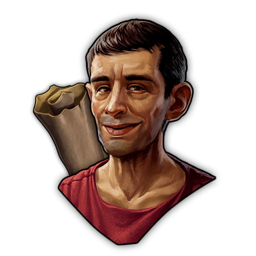 | 1600000118 | Specialist Prod-Upholsterers-E | Lucius Textor, the Textile Craftsmen | Always stocks up on every kind of fabric. (Industry-Pack) | All Upholsterers | • +35% Productivity Boost |
| 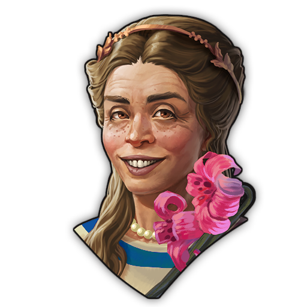 | 1600000252 | Specialist Prod-Artisans-E | Junia Daedala, Master Embellisher | Through her artistry, she shows the world her own beauty. (Industry-Pack) | All Artisanal Studios | • +35% Productivity Boost |
|  | 1600000248 | Specialist Prod-Kitchens-E | Julia Culinaria | "Show me the kitchen and I'll whip up something delicious faster than you can blink." (Industry-Pack) | All Kitchens | • +35% Productivity Boost |
| 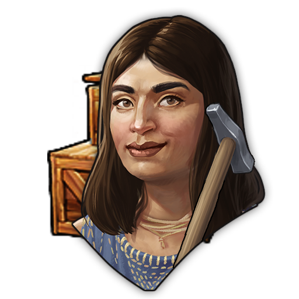 | 1600000139 | Specialist Prod-Workshops-E | Apprilia, Early Engineer | Dreams of an age of machines and steam. (Industry-Pack) | All Workhops | • +35% Productivity Boost |
| 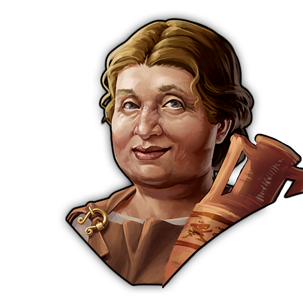 | 1600000120 | Specialist Prod-Victuallers-E | Cornelia Fusilla, Fluid Artista | Knows how to work with Liquids and Jars. (Industry-Pack) | All Victuallers | • +35% Productivity Boost |
|  | 1600000250 | Specialist Prod-Dressers-E | Bennicus Sartor Steckus, Swift with the Needle | "Fine feathers make fine birds! You can never have enough clothes!" (Industry-Pack) | All Clothiers | • +35% Productivity Boost |

#### Epic Replace Input Specialists
| Image Preview | GUID | Internal Name | Item name (Title) | Description | Targets | Base Effects |
| :---: | :---: | :---: | :---: | :---: | :---: | :---: |
| 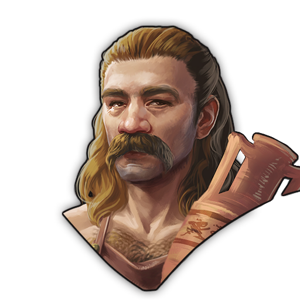 | 1600000130 | Specialist ReInput-FGlass-SiliziaRGlass-E | Vitrearios, the Glassmaker | Shapes the glass in form directly in front of your eyes. (Industry-Pack) | Glassblower | • Adds an additional output of Fine Glass every 10 cycles. • Replaces required input from Glass to Silica. |
***
### Legendary Specialists
| Image Preview | GUID | Internal Name | Item name (Title) | Description | Targets | Base Effects | Boosted Effects | Boost Condition |
| :---: | :---: | :---: | :---: | :---: | :---: | :---: | :---: | :---: |
| 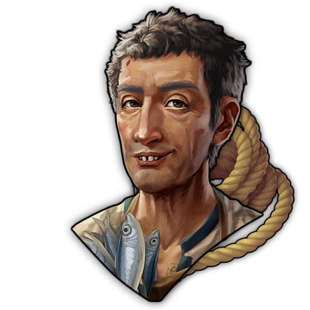 | 1600000152 | Specialist CrazyLatiumFisheries-L | Aquarius Crassicius, Crazy Fisherman | Has the hope to catch a mermaid by using overdimentional nets. Instead he finds sandals and sometimes a lost sheep. | Fishing Hut (Sardines), Oyster Bed, Scomber's Shack (Mackerels), Sturgeon Hatchery | Additional output: • +1 Same Product as Factory (every 2 cycles)  • Gold (every 40 cycles)  • Sandals (every 40 cycles)  • Sheep (every 42 cycles). | Additional output: • Same Product as Factory (every cycle) • Gold (every 8 cycles) • Sandals (every 40 cycles) • Sheep (every 42 cycles). | 3x Ropemaker on Island - valid only in Latium |
|  | 1600000888 | Specialist CrazyHoneyBear-L | _PlaceholderTitle | _PlaceholderDesc | Beekeeper | Additional output: • +2 Honeycombs (every 7 cycles)  • +1 Sardines (every 16 cycles) | Additional output: • +2 Honeycombs (every 3 cycles) • +1 Sardines (every 8 cycles) | At Most: 3x Sardinefisher on Island |

